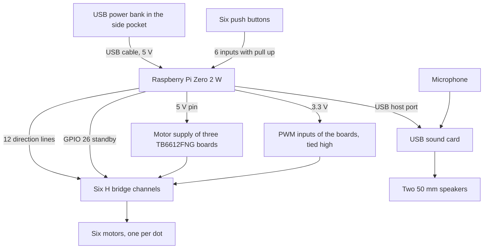

%% Draft prepared from the project files on 2026-09-21. Every dimension, date and setting below comes from the SCAD sources, STL exports and the Pi code in Research/Moo Moo & Redesign. The dark block and the grey discs in the images are illustrative stand ins for the power bank and the speakers and are not part of the SCAD source. Electrical limits are quoted from the Toshiba datasheet and the Raspberry Pi documentation listed under References. Blocks marked TO FILL need Philip. File times are the last saved time of each file in Toronto time. %%

# Goals
- Run the whole device from one USB power bank so that it can be used without a wall plug or a computer beside it
- Carry the power bank on the device in a way that lets it be taken out for charging without opening the casing
- Mount two speakers inside the casing without screws or glue
- Keep six motors from pulling the supply of the Raspberry Pi down when they start

# Description
The first device was tethered. The [[DIY Tutorial]] of the first workbook has the power supply wires and the cables to a monitor and keyboard leaving through a hole in the casing, and [[18. Additional Compartment for Electronics.]] records holes melted into the casing for the cables to the computer. The motors were driven by an ESP32 that talked to the Raspberry Pi over UART (see [[15. Raspberry Pi Zero 2 W and ESP32 UART connection]]). The redesign removes the ESP32. The Raspberry Pi Zero 2 W drives the three TB6612FNG boards directly from its GPIO pins, and everything, the Pi, the USB sound card and the six motors, is fed from one power bank.

That decision shows up in two places in the folder. In the middle shell it is a printed pocket on the outside of one long wall, sized for a power bank of 160 by 18 by 60 mm, together with zip tie slots for two 50 mm speakers on the back wall. In the Pi code it is a set of rules about when motors may start and how long they may run, written because the motors and the computer share one 5 V rail. This step documents both, because neither makes sense without the other.

# File Timeline
| Date | Files saved | What they show |
|---|---|---|
| 9 May 2026, 19:35 to 22:21 | `pi/config.py`, the setup service and the first pages of the setup app, 28 files | Configuration is written to disk in a way that survives a power cut in the middle of a write |
| 11 May 2026, 14:42 | `middleCasingHooksWPocket.stl` | First middle shell with a pocket on its side |
| 16 May 2026, 00:35 to 13:50 | Audio, API key, calibration and preference pages, `pi/assistant/braille.py`, 9 files | Setup wizard with a calibration page that pulses one motor at a time |
| 17 May 2026, 23:35 to 23:38 | `pi/setup_service/main.py`, `pi/setup_service/services/braille_hw.py` | One owner at a time for the braille hardware |
| 19 May 2026, 10:57 | `middleCasingHooksPowerPocketandZipSpeakersAdjusted.stl` | Pocket adjusted and speaker slots added |
| 19 May 2026, 14:08 to 17:55 | `pi/assistant/braille_gpio.py`, `audio.py`, `main.py`, `story.py` and six more | GPIO driver with staggered motor starts, a hard limit on run time and standby held low at boot |
| 21 May 2026, 21:12 | `middleCasingHooksPowerPocketandZipSpeakers.scad` | Final source of the middle shell, saved 45 minutes after the final source of the bottom shell |
| 22 Jul 2026, 20:25 to 21:20 | `pi/bluetooth_service/`, `BLUETOOTH_SETUP.md`, `pi/install.sh`, dashboard pages, 25 files | Bluetooth service and a dashboard hosted on GitHub Pages |

Reading the dates back, the pocket and the power rules belong to the same ten days. The first pocket was exported on the afternoon of 11 May, two days after the file that protects the configuration against a power cut. The adjusted pocket was exported at 10:57 on 19 May, and the driver that staggers the motors was saved between 14:08 and 17:55 on the same day. One reading is that the device ran from the power bank for the first time that day and that the code was changed in answer to what happened. After 21 May no design file in the folder was saved again. The only later activity is software, two months on, and it is about reaching the device without a cable.

# Prototyping
![[MooMooRedesign_29_middle_shell_exploded.png]]
1 middle shell, 2 the pocket on its outside, 3 power bank lifted out, drawn as a block of the size the pocket allows, 4 zip tie slots in the far wall, 5 the two speakers, drawn as 50 mm discs

## The pocket
![[MooMooRedesign_29_middle_casing_empty.png]]
OpenSCAD view of `middleCasingHooksPowerPocketandZipSpeakers.scad`. The pocket runs along the near long wall. The notch at its right end opens the end wall of the pocket from 20 mm above the lower edge to the top

![[MooMooRedesign_29_power_bank_pocket_lifted.png]]
The same shell from the other side with a block of 160 by 18 by 60 mm being lowered into the pocket, and two discs of 50 mm where the speakers sit

![[MooMooRedesign_29_power_bank_pocket_seated.png]]
Block seated in the pocket

| Feature | Value |
|---|---|
| Power bank the pocket is drawn for | 160 mm long, 18 mm thick, 60 mm tall |
| Clearance around the power bank | 1.5 mm on every side |
| Cavity | 163 by 21 mm, 61 mm deep |
| Pocket wall and floor | 3 mm each. The wall of the shell is shared, so only the outer wall and the two ends are added |
| Outside of the pocket | 169 mm long, stands about 24 mm out from the shell, chamfered at both outer corners like the shell itself |
| Top | Open. The top shell covers the 205 by 140 mm body only, so the power bank can be lifted out with the device closed |
| Notch | 20 mm wide, cut from the top down to 20 mm above the lower edge of the shell, through the end wall of the pocket that faces the back of the device |

The pocket adds about 24 mm to one side of the device, so the middle of the device is about 164 mm wide where the rest is 140 mm.

> [!todo] TO FILL
> The power bank model, its capacity and its rated output current. Which end its USB socket is on and whether the notch is there for the plug, for the button of the power bank, or to push the power bank out.

## From the pocket to the Pi
The pocket is outside the casing and the Pi is inside the bottom shell, on the opposite long wall (step 28). The files show two openings that a cable could use. The notch at the back end of the pocket, and the slot of 20 by 3 by 20 mm in the front wall of the bottom shell. Neither is next to the Pi.

> [!todo] TO FILL
> The actual route of the power cable from the power bank to the Pi, the cable type and length, and whether there is a switch. A photo of the cable where it enters the casing.

## Speaker mounts
![[MooMooRedesign_29_middle_casing_speaker_wall.png]]
The back wall of the middle shell with its eight zip tie slots

Two speakers of 50 mm sit against the inside of the back wall, 35 mm either side of the centre line and at half the height of the shell. Each has four slots of 6 by 3 mm through the wall, one above, one below and one on each side, 27 mm from the centre of the speaker. A zip tie through two opposite slots holds the speaker against the wall. The Pi has one USB data port, and `install.sh` sets it to host mode for a USB sound card that carries both the microphone and the speaker output.

> [!todo] TO FILL
> Speaker model and whether there is an amplifier between the sound card and the speakers. Whether the wall needs sound holes. At present only the zip tie slots pass through it.

## One supply, three kinds of load


The diagram follows the comments in `braille_gpio.py` and `install.sh`. The PWM inputs of the driver boards are tied to 3.3 V, so the motors always run at full speed and only their direction is switched.

| Limit | Value | Source |
|---|---|---|
| TB6612FNG motor supply | 2.5 to 13.5 V in operation, 15 V maximum | Toshiba datasheet |
| TB6612FNG output current for each channel | 1.2 A average, 3.2 A peak | Toshiba datasheet |
| TB6612FNG in standby | Outputs off, high impedance | Toshiba datasheet |
| Raspberry Pi Zero 2 W typical active current, bare board | 350 mA | Raspberry Pi documentation |
| Raspberry Pi Zero 2 W recommended supply | 5 V, 2 A | Raspberry Pi documentation |

## What the code does about the shared rail
These are the three constants at the top of `pi/assistant/braille_gpio.py`, with the comments as they stand in the file.

```python
MOTOR_COUNT = 6
# HARD SAFETY CAP. A motor must never stay energized longer than this — a
# stuck-on motor overheats and can melt the casing. The watchdog (_loop)
# force-stops any motor past this, and a re-command in the same direction
# does NOT extend it, so the cap is measured from the first activation.
# Keep this well under 2 seconds.
MOTOR_RUN_SECONDS = 1.5
# Motors are powered through the Pi's 5V rail, so stagger their start times
# to keep inrush current spikes from stacking and browning out the Pi.
MOTOR_STAGGER_SECONDS = 0.15
# A button press lowers its motor, but motor noise can glitch the button
# lines into phantom presses. Allow only one button-driven lowering per
# motor per this interval, so phantoms can't re-energize a motor in a loop.
BUTTON_RELOWER_MIN_SECONDS = 2.5
```

| Rule | What it protects |
|---|---|
| Motors start 0.15 s apart | The inrush current of each motor has passed before the next one starts, so the peaks do not add up on the 5 V rail of the Pi |
| No motor runs longer than 1.5 s, enforced by a watchdog thread every 0.05 s | A stalled motor at the end of its travel cannot heat up inside a PETG part. This is also the end stop. There is no limit switch and no aluminium foil sensor as in [[10. Motor block aluminum sensor and AI-Thinker Board]] |
| Standby of all three driver boards is on GPIO 26, which is pulled down at boot | The H bridges stay off while the Pi boots and whenever the driver is not running, whatever the direction pins are doing |
| A button may lower its motor only once every 2.5 s | Electrical noise from a motor can look like a button press. Without the limit a phantom press would start the motor again, which makes more noise |
| `config.py` writes to a temporary file, flushes it to disk and renames it | A power bank that is switched off or runs empty during a write cannot leave half a configuration file behind |

A letter with five dots, such as Q or Y, has its last motor starting 0.6 s after the first. From then until 1.5 s all five run together. The stagger spreads the starting peaks but does not reduce the current while all five are running.

> [!todo] TO FILL
> Measured current of one motor when running and when stalled, and of the whole device while a five dot letter rises. Whether the Pi ever rebooted when the motors started, before or after the stagger was added.

## The power bank side
Many USB power banks switch their output off when the current drawn from them stays below a threshold. The Pi Hut, for example, sells a keep alive module that draws pulses of 100 to 170 mA for this reason. A Pi Zero 2 W that is waiting for a child to speak draws little, so this is worth checking with the power bank that is actually in the pocket.

> [!todo] TO FILL
> Whether the power bank has ever switched itself off while the device was idle. How long one charge lasts in a session.

## Code
```
include <BOSL2/std.scad>

$fa = 1;
$fs = 0.4;

// ---- Main Side Lengths ----
LENGTH = 205;
WIDTH = 140;
HEIGHT = 64;

// ---- Rounding ----
ROUNDING = 10;

// ---- Edge Thickness ----
EDGE_THICKNESS = 3;
EDGE_THICKNESS_ATTACHMENT = 2;

// ---- BOTTOM Triangle marker settings (pegs) ----
BOTTOM_TRIANGLE_HEIGHT = 9.6;
BOTTOM_TRIANGLE_Z = 1.9;
BOTTOM_TRIANGLE_RADIUS = 2;

// ---- TOP Triangle marker settings (holes in cubes) ----
TOP_TRIANGLE_HEIGHT = 10.5;
TOP_TRIANGLE_Z = 1.8;  // (2.2 - 0.4)
TOP_TRIANGLE_RADIUS = 2.7;

// ---- BOTTOM Triangle marker positions (pegs on bottom part) ----
BOTTOM_TRIANGLE_POSITIONS = [
    [[-98.45, -30], [90, 0, 0]],
    [[-98.45, 30], [90, 0, 0]],
    [[98.45, -30], [90, 0, 180]],
    [[98.45, 30], [90, 0, 180]],
    [[50, 66], [90, 0, -90]],
    [[-50, 66], [90, 0, -90]],
    [[50, -66], [90, 0, 90]],
    [[-50, -66], [90, 0, 90]]
];

// ---- TOP Triangle marker positions (holes in top cubes) ----
TOP_TRIANGLE_POSITIONS = [
    [[-98.45, -30], [90, 0, 0]],
    [[-98.45, 30], [90, 0, 0]],
    [[98.45, -30], [90, 0, 180]],
    [[98.45, 30], [90, 0, 180]],
    [[50, 65.9], [90, 0, -90]],
    [[-50, 65.9], [90, 0, -90]],
    [[50, -65.9], [90, 0, 90]],
    [[-50, -65.9], [90, 0, 90]]
];

// ---- Snap-fit cube receivers ----
CUBE_WIDTH = 4;
CUBE_LENGTH = 8;
CUBE_HEIGHT = 15;
CUBE_Z = -1;
CUBE_HOLE_Z_OFFSET = -4.2;

CUBE_POSITIONS = [
    [[-97.5, -30], [90, 0, 0]],
    [[-97.5, 30], [90, 0, 0]],
    [[97.5, -30], [90, 0, 180]],
    [[97.5, 30], [90, 0, 180]],
    [[50, 65], [90, 0, -90]],
    [[-50, 65], [90, 0, -90]],
    [[50, -65], [90, 0, -90]],
    [[-50, -65], [90, 0, -90]]
];

// ---- Speaker mounting (back face, +X wall) ----
SPEAKER_SIZE = 50;
SPEAKER_CLEARANCE = 2;
ZIPTIE_SLOT_LENGTH = 6;
ZIPTIE_SLOT_WIDTH = 3;
ZIPTIE_OFFSET = SPEAKER_SIZE / 2 + SPEAKER_CLEARANCE;
SPEAKER_Y_OFFSET = 35;
SPEAKER_Z = HEIGHT / 2;
SLOT_THROUGH = EDGE_THICKNESS * 4;

// ---- Powerbank external pocket (on -Y wall, the "left" long side) ----
POWERBANK_LENGTH = 160;     // X dimension of powerbank (along the long wall)
POWERBANK_THICKNESS = 18;   // Y dimension (how far it sticks out from wall)
POWERBANK_HEIGHT = 60;      // Z dimension (vertical, should be ≤ HEIGHT)

POCKET_TOLERANCE = 1.5;     // gap around powerbank for easy fit
POCKET_WALL = 3;            // pocket wall thickness
POCKET_FLOOR = 3;           // pocket floor thickness (powerbank rests on this)
POCKET_OVERLAP = 0.5;       // sliver of overlap with casing wall for clean union

POCKET_INNER_X = POWERBANK_LENGTH + POCKET_TOLERANCE * 2;
POCKET_INNER_Y = POWERBANK_THICKNESS + POCKET_TOLERANCE * 2;
POCKET_INNER_Z = HEIGHT - POCKET_FLOOR;
POCKET_BLOCK_X = POCKET_INNER_X + POCKET_WALL * 2;
POCKET_BLOCK_Y = POCKET_INNER_Y + POCKET_WALL;   // only outer wall, casing wall is shared

// =============== MODULES ===============

module casing(length, width, height, rounding) {
    cuboid([length, width, height],
        anchor=BOT,
        chamfer=rounding,
        edges=[FRONT+RIGHT, FRONT+LEFT, BACK+RIGHT, BACK+LEFT],
        $fn=128
    );
}

module bottomTriangleMarkers() {
    for (pos = BOTTOM_TRIANGLE_POSITIONS)
        translate([pos[0][0], pos[0][1], BOTTOM_TRIANGLE_Z])
            rotate(pos[1])
                cylinder(BOTTOM_TRIANGLE_HEIGHT, BOTTOM_TRIANGLE_RADIUS, BOTTOM_TRIANGLE_RADIUS, anchor=CENTER, $fn=3);
}

module topTriangleMarkers() {
    for (pos = TOP_TRIANGLE_POSITIONS)
        translate([pos[0][0], pos[0][1], TOP_TRIANGLE_Z])
            rotate(pos[1])
                cylinder(TOP_TRIANGLE_HEIGHT, TOP_TRIANGLE_RADIUS, TOP_TRIANGLE_RADIUS, anchor=CENTER, $fn=3);
}

module snapCubesWithHoles() {
    for (pos = CUBE_POSITIONS)
        translate([pos[0][0], pos[0][1], CUBE_Z])
            rotate(pos[1])
                cube([CUBE_WIDTH, CUBE_LENGTH, CUBE_HEIGHT], anchor=CENTER);
}

module ziptieGroupForSpeaker() {
    zcopies(spacing=ZIPTIE_OFFSET * 2, n=2)
        cube([SLOT_THROUGH, ZIPTIE_SLOT_LENGTH, ZIPTIE_SLOT_WIDTH], center=true);

    ycopies(spacing=ZIPTIE_OFFSET * 2, n=2)
        cube([SLOT_THROUGH, ZIPTIE_SLOT_WIDTH, ZIPTIE_SLOT_LENGTH], center=true);
}

module ziptieHoles() {
    ycopies(spacing=SPEAKER_Y_OFFSET * 2, n=2)
        translate([LENGTH / 2, 0, SPEAKER_Z])
            ziptieGroupForSpeaker();
}

module powerbankPocket() {
    block_y_center = -WIDTH/2 - POCKET_BLOCK_Y/2 + POCKET_OVERLAP;
    cavity_y_center = -WIDTH/2 - POCKET_INNER_Y/2;
    cavity_z_center = POCKET_FLOOR + POCKET_INNER_Z/2 + 0.5;

    difference() {
        translate([0, block_y_center, HEIGHT/2])
            cuboid([POCKET_BLOCK_X, POCKET_BLOCK_Y, HEIGHT],
                chamfer=ROUNDING,
                edges=[FRONT+LEFT, FRONT+RIGHT],
                $fn=128);

        translate([0, cavity_y_center, cavity_z_center])
            cuboid([POCKET_INNER_X, POCKET_INNER_Y, POCKET_INNER_Z + 1],chamfer=ROUNDING-1,
                edges=[FRONT+LEFT, FRONT+RIGHT],
                $fn=128, center=true);
    }
}

// =============== MAIN ASSEMBLY ===============

difference() {
    union() {
        difference() {
            casing(LENGTH, WIDTH, HEIGHT, ROUNDING);
            casing(LENGTH - EDGE_THICKNESS*2, WIDTH - EDGE_THICKNESS*2, HEIGHT + EDGE_THICKNESS*2, ROUNDING - (EDGE_THICKNESS/2));
        }
        difference(){
        powerbankPocket();
               translate([80,-80,64])
         cuboid([20,20,44],anchor=TOP,center=true);
        }

    }
    ziptieHoles();
}

bottomTriangleMarkers();

translate([0, 0, HEIGHT])
    mirror([0, 0, 1])
        difference() {
            snapCubesWithHoles();
            translate([0, 0, CUBE_HOLE_Z_OFFSET])
                topTriangleMarkers();
        }
```

# Creating
> [!todo] TO FILL
> Photos of the middle shell with the power bank in its pocket and the speakers tied in. A photo of the wiring between the Pi, the three driver boards and the 5 V line. Print settings of the middle shell if they differ from the bottom shell in step 28.

## Print Settings
No slicer project was saved for the middle shell. The bottom shell of the same footprint was printed on the Original Prusa MK4S in Elegoo Rapid PETG at 0.15 mm (step 28).

# Cost
| Item | Description | Unit Price (CAD) |
|---|---|---|
| USB power bank | 160 by 18 by 60 mm class | TO FILL |
| USB cable | Power bank to Pi | TO FILL |
| USB sound card | Microphone in, speaker out | TO FILL |
| Speaker | 50 mm, two in total | TO FILL |
| Zip ties | For two speakers | TO FILL |
| PETG filament | Middle shell with pocket | TO FILL |
| **Total** | | TO FILL |

# Critical Reflection
## The pocket on the outside
**Pros**
- The power bank is charged like any other power bank. It lifts out of the top of the pocket and nothing has to be opened
- The pocket shares a wall with the shell, so it adds three thin walls and a floor and very little printing time
- One change of three numbers at the top of the file fits the pocket to another power bank, which matters for a device that others are meant to build with the parts they can get
- The weight of the power bank sits low, on the floor of the pocket, along the long side of the device

**Cons**
- The device is no longer symmetrical and is 24 mm wider on one side
- The pocket is on the opposite side of the device from the Pi, so the 5 V cable has to cross the device or go around it
- The pocket fits one size of power bank. A thicker one does not go in at all

## One rail for the computer and the motors
**Pros**
- One cable, one power bank, no second battery and no regulator board. That keeps the parts list short, which fits the low barrier principle on the front page of this site
- The protections are in software and are documented where they are used

**Cons**
- Motor current flows through the Pi board on its way from the USB socket to the 5 V pin. The limit is therefore set by the power bank, the cable and the Pi, and not by the driver, whose datasheet allows 1.2 A for each channel
- The watchdog replaces a position sensor with a time limit. A dot that meets more friction rises less far in the same 1.5 s, so dot height depends on the fit of each printed screw (step 26)
- All of this was tuned for one power bank and one set of motors

## One thing to check in the code
`pi/assistant/braille_letters.py` gives the letter M the dots (0, 1, 2), which is the same as the letter F. With the numbering used in that file, where K is (0, 4) and L is (0, 2, 4), M should be (0, 1, 4).

## Where the redesign stands
After 21 May 2026 the folder is quiet until 22 July, when the Bluetooth service and the hosted dashboard were added. The hardware of the redesign can therefore be read as finished on 21 May, with a casing of three shells, six plug in actuators of twelve printed parts each, a computer on a sliding plate, and a power bank in a pocket. What the folder cannot show is how the device behaved in a child's hands, and that is what the TO FILL blocks across these ten steps are waiting for.

> [!todo] TO FILL
> First session with the battery powered device. Where it was used, for how long, and what broke first.

# References
Toshiba. (2012). *TB6612FNG driver IC for dual DC motor, datasheet*. Retrieved September 21, 2026, from https://cdn-shop.adafruit.com/datasheets/TB6612FNG_datasheet_en_20121101.pdf

Raspberry Pi Ltd. (n.d.). *Raspberry Pi hardware documentation, power supply*. Retrieved September 21, 2026, from https://www.raspberrypi.com/documentation/computers/raspberry-pi.html

The Pi Hut. (n.d.). *Power Bank KeepAlive (Adjustable)*. Retrieved September 21, 2026, from https://thepihut.com/products/power-bank-keepalive-adjustable

Nuttall, B., & Jones, D. (n.d.). *gpiozero documentation*. Retrieved September 21, 2026, from https://gpiozero.readthedocs.io/
